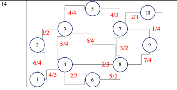
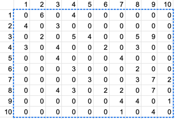

# Максимизация потока в сетях связи

Задание лабораторной работы.


Создаздадим матрицу.

``` 
# Задаем граф в виде матрицы смежности
graph = [[0, 6, 0, 4, 0, 0, 0, 0, 0, 0],
[4, 0, 3, 0, 0, 0, 0, 0, 0, 0],
[0, 2, 0, 5, 4, 0, 0, 5, 9, 0],
[3, 0, 4, 0, 0, 2, 0, 3, 0, 0],
[0, 0, 4, 0, 0, 0, 4, 0, 0, 0],
[0, 0, 0, 3, 0, 0, 0, 2, 0, 0],
[0, 0, 0, 0, 3, 0, 0, 3, 7, 2],
[0, 0, 4, 3, 0, 2, 2, 0, 7, 0],
[0, 0, 0, 0, 0, 0, 4, 4, 0, 1],
[0, 0, 0, 0, 0, 0, 1, 0, 4, 0]]


# Функция для поиска максимального потока
def max_flow(graph, source, sink):
    # Изначально поток равен 0
    max_flow = 0
    # Ищем увеличивающий путь
    while True:
        # Инициализируем очередь для поиска в ширину
        queue = [source]
        # Инициализируем словарь, хранящий информацию о предыдущей вершине на пути
        prev = {source: None}
        # Пока очередь не пуста
        while queue:
            # Извлекаем вершину из очереди
            node = queue.pop(0)
            # Если мы достигли стока, то выходим из цикла
            if node == sink:
                break
            # Проходимся по всем смежным вершинам
            for i in range(len(graph[node])):
                # Если есть связь и вершина еще не была посещена
                if graph[node][i] > 0 and i not in prev:
                    # Добавляем вершину в очередь и запоминаем предыдущую вершину
                    queue.append(i)
                    prev[i] = node
        # Если не найдено увеличивающего пути, то выходим из цикла
        if sink not in prev:
            break
        # Находим минимальную пропускную способность на пути
        path_flow = float("inf")
        node = sink
        while node != source:
            path_flow = min(path_flow, graph[prev[node]][node])
            node = prev[node]
        # Обновляем значения ребер на пути и максимальный поток
        node = sink
        while node != source:
            graph[prev[node]][node] -= path_flow
            graph[node][prev[node]] += path_flow
            node = prev[node]
        max_flow += path_flow
    # Возвращаем максимальный поток
    return max_flow

# Тестируем функцию
source = 1
sink = 9

print("Максимальный поток в графе:", max_flow(graph, source, sink))
``` 